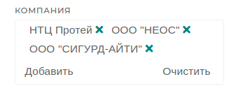

Debug ids находятся в одноимённом классе **DebugIds**.

### Правила добавления Debug ids

1. Debug id необходимо добавлять для **каждого** нового элемента на UI (поле ввода, селектор и т.д.).  
   Это необходимо для возможности его автоматического тестирования.

2. На уникальные элементы на странице Debug id добавляются следующим образом:

```kotlin
element.ensureDebugId(DebugIds.ELEMENT.DEBUG_ID_NAME)   или
element.setEnsureDebugId(DebugIds.ELEMENT.DEBUG_ID_NAME)
```

3. Для мультиселекторов Debug ids добавляются следующим образом:



```kotlin
element.ensureDebugId(DebugIds.ELEMENT.ELEMENT_SELECTOR);
element.setAddEnsureDebugId(DebugIds.ELEMENT.ELEMENT_ADD_BUTTON);
element.setClearEnsureDebugId(DebugIds.ELEMENT.ELEMENT_CLEAR_BUTTON);
element.setItemContainerEnsureDebugId(DebugIds.ELEMENT.ELEMENT_ITEM_CONTAINER);
```

4. На повторяющиеся элементы на странице (например, выбранные элементы мультиселектора), нужно добавлять **DEBUG_ID_ATTRIBUTE**:

```kotlin
element.getElement().setAttribute(DEBUG_ID_ATTRIBUTE, DebugIds.ELEMENT.DEBUG_ID_NAME);
```

#### Не нужно добавлять Debug ids:

1. На label-элементы (не тестируются).
2. На элементы выпадающего списка.
