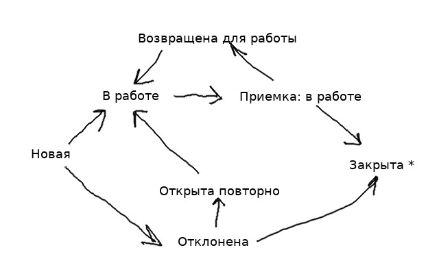

## Тестовый стенд

**Стенд**: http://192.168.110.12:8080/portal-branch/

**Подключение**: ssh support@192.168.110.12 "Wehicfid3"

**Настройки приложения**: /tomcat/cfg2

**Логи**: /tomcat/logs/portal2

**Настройки Winter**: приложение Портал используется отдельно от конфигурации, чтобы можно было обновить приложение не меняя настройки

Каталог с настройками "зашит" в war'ике и должен быть изменен при деплое - это делается в Jenkins, чтобы указывалось на свой каталог "cfg2"

_portal-branch/WEB-INF/classes/_
- spring.properties
- log4j2.component.properties

**Jenkins** :
- сборка : https://jenkins.protei.ru/job/team7/job/Portal/job/build_Portal_by_branch/
- деплой : https://jenkins.protei.ru/job/team7/job/Portal/job/deploy%20integrations%20(192.168.110.12)/


**Особенности**:
- Указывает на одну и ту же базу с тестовым стендом - изменения в базе повлияют на оригинальный тестовый стенд
- Если необходимо поправить натройки/патч базы - делается это вручную

## Jira

Задача: https://youtrack.protei.ru/issue/PORTAL-467

Отличия от Порталовских обращений

- Компании заказчик - группа компаний "Nexign *"
- Свой workflow статусов
- Форматировании комментариев - Jira Markup вместо Markdown
- Новый тип комментариев: полуприватный - виден нам и админам Nexign, не видны заказчикам Nexign
- Создаются **только** на стороне Jira

### Тестирование

- Создать на стороне Jira, обязательно повесить **label "sandbox"**

### Организация обмена:

Направление Jira - Portal (JiraIntegrationServiceImpl.class):

На каждое изменение со стороны Jira отправляются json web хуки.
Вебхуков много: отправляется как частичные изменения, так потом отправляется огромный json со всем обращением: все поля + комментарии.
Мы обрабатываем только крупные изменения.

Синхронизируются только часть изменений:
- название обращения
- описание
- статус
- критичность
- новые вложения
- новые комментарии

**Пример json web хука**: portal/module/jira/src/test/resources

**Перенаправление Nginx**

Так как что ко внутреннему рабочему портал, что к тестовому стенду есть доступ только локально, 
то необходимо перенаправлять web хуки с внешнего сервера на локальные сервера.

В интернет смотрит crm2.protei.ru(10.0.0.18) и настраивается nginx в /etc/nginx/conf.d/crm2.protei.ru.conf

ssh frost@crm2.protei.ru "oXaidee4"

**Неудобства web хуков**

Если нет доступа к Порталу со стороны Jira (деплой Портала, работа на сетевом оборудовании, упавшая сеть),
то web хуки не отрабатываются и даже нет возможности узнать какие обращения не синхронизированы.

В Jira нет механизма для пересинхронизации/перезапроса web хуков за определенное время (например, за последние 2 часа пока сеть лежала)

Костыль, если необходима пересинхронизация отдельного обращения:
- пишется произвольный тестовый комментарий в порталовском обращении
- jira обрабатывает этот комментарий и отправляет в сторону Портала web хук


**Проекты Jira**

На стороне Jira есть пограничный проект PRT, который связан уже внутренними проектами Jira (CLM/UCL/CGTMR)
И изменения обращения проходят такой путь CLM/UCL/CGTMR -> PRT => Portal

https://jira.nexign.com/browse/PRT-566

https://jira.nexign.com/browse/CGTMR-20513

**Пользователи на стороне Jira**

Для технических пользователей не обязательны Cisco VPN и 2-х факторная авторизация

Связь: CLM/UCL/CGTMR -> PRT = protei_sync_user

Связь: PRT => Portal = protei_tech_user


**Определение Идентификатора обращения** (JiraIntegrationServiceImpl.selectEndpoint)

У Nexign есть группа компаний, для каждой есть точка доступа таблица "jira_endpoint"

В таблице "case_object" есть поля:
- EXT_APP = "jira"
- EXT_APP_ID = 2_PRT-646, где
  - 2 - id в таблице jira_endpoint
  - PRT-646 - id в пограничном проекте на стороне Jira
- EXT_APP_DATA - специфичная для интеграции информация

**Определение/добавление endpoint**
1) В url вебхука "/jira/{companyId}/wh" указывает компания companyId=72133 "NexignJira" - общая компания
   Далее надо проверить, относится ли обращение к компании, которая являет подструктурой общей компании (COMPANY_GROUP), иначе используется головная компания
   Это проверяется по кастом полю в json
```json
{
  "issue": {
    "fields": {
      "customfield_12375": {
        "name": "kcell_Group",
        "self": "https://jira.nexign.com/rest/api/2/group?groupname=kcell_Group"
      }
    }
  }
}
``` 
Константы на различные имена полей хранятся в **CustomJiraIssueParser.class**

Необходимо прописать в базе новую группу "portal.jira_company_group", где
- "kcell_Group" - "name" поля "customfield_12375"
- 72389 - id компании от имени которой будет создаваться/обновляться обращения

```sql
INSERT INTO portal.jira_company_group (jira_company_name, company_id) VALUES ('kcell_Group', 72389);
```

2) Далее надо прописать jira_endpoint для этой компании.
   Для компании добавить пользователей для интеграции (protei_tech_user)

```sql
INSERT INTO portal.person (created, creator, company_id, firstname, lastname, secondname, displayname, displayPosition, sex, birthday, info, ipaddress, isdeleted, department_id, department, displayShortName, isfired, relations, old_id, locale, firedate, inn) VALUES (now(), 'jira-integration-service', 72389, null, null, null, 'protei_tech_user', null, '-', null, null, null, 0, null, null, 'protei_tech_user', 0, null, null, 'ru', null, null);
```

прописать jira_endpoint (**тут надо подставить ID пользователя protei_tech_user из прошлого шага**)
```sql
INSERT INTO portal.jira_endpoint (server_addr, project_id, COMPANY_ID, STATUS_MAP_ID, PRIORITY_MAP_ID, person_id, server_login, server_pwd, SLA_MAP_ID) VALUES ('https://jira.nexign.com/', '23415', 72389, 1, 1, !!!!, 'protei_tech_user', 'FAut>WxJ9q', 1);
```

**Дублирование обращений на стороне jira**

Глюки на стороне Jira приводят иногда к задублированию обращений на пограничном проекте PRT:
на один CLM может создаться несколько проектов PRT.
Хоть у нас все проекты помечены как PRT, в case_object.EXT_APP_DATA есть projectId с (CLM/UCL/CGTMR-*),
и обращение при поступлении еще проверяется на задублирование по названию Проекта.

**Маппинг статуса / критичности**

Таблицы:
- статус - jira_status_map_entry
- критичности - jira_priority_map_entry

**Обработка комментариев**
- игнорируются комментарии/вложения, прилетевшие со стороны Портала
- если полуприватные комментарии - то используются роли в jira комментариях "Project Customer Role", "Project Support Role"
- подмена ссылок вложенных изображений на Порталовское хранилище


## Redmine

Отличия от Порталовских обращений

- Компании заказчик "Департамент информатизации Тюменской области"
- Свой workflow статусов

### Организация обмена
Необходимо установить крипто-ключи, для этого используется отдельный Chrominum GOST / Yandex browser

Пример настройки подключения
```
1) инструкция для доступа через сайт https://citto.ru/subsections/32
www.cryptopro.ru
porubov@protei.ru
cryptoproPASS#1
2) когда установишь, идти нужно сюда https://testagile.72to.ru/ 
3) логин/пароль SizkoDE/********
Там все просто - учетка прикреплена к тестовому проекту, мы видим и имеем доступ только к issue в рамках этого проекта.
```

**Тестовая площадка**: https://testagile.72to.ru

**Продашн** : https://agile.72to.ru/

Redmine - Portal (RedmineForwardChannel.class):

Получение новых данных происходит поллингом "RedmineIssuesCheckRunner.class"
Каждые 5 минут опрашивается сервер на наличие новых открытых обращений/обновлений

**Определение Идентификатора обращения**

В таблице "redmine_endpoint" хранятся данные для подключения, а так же "last_created"/ "last_updated"
для определения новизны данных на стороне Redmine.

В таблице "case_object" есть поля:
- EXT_APP = "redmine"
- EXT_APP_ID = 45792_2934, где
  - 45792 - id проекта на стороне redmine
  - 2934 - id связанной компании в портале
- EXT_APP_DATA - специфичная для интеграции информация

**Тестирование**
- Обращения создаются на тестовая площадке: https://testagile.72to.ru
- Обращения создаются **только** на стороне Redmine

**Пользователи на стороне Jira**

Пользователь для тестирования SizkoDE / пароль периодически обновляется

**Таблицы маппинг статусов, критичностей**
- redmine_status_map_entry
- redmine_priority_map_entry

**Маппинг статусов**

Наши статусы как сущности мапятся на переходы между статусами Redmine.

**Граф переходов статусов**



## 1С

Работа с 1С в части договоров идет с основным приложением Портала.
Для работы с сотрудниками существует отдельное приложение "ws-api".
Это АПИ не включено в основное приложение Портал, поэтому:
- можно изменять отдельно
- АПИ не "торчит" в интернет


Само приложение в проекте Портала выбирается отдельным Maven профилем "ws-api"
и лежит в отдельном Maven модуле "ws-api".

Сборка: 
- собрать "jar", локально выбран maven профиль "ws-api" 
- скопировать на тестовый стенд "192.168.110.12" /usr/protei/portal-api 

После тестирования со стороны 1С: 
- внести изменения и собрать jar 
- скопировать на продукт сервер "192.168.110.68" /usr/protei/portal-api 

Deploy:
- остановить приложение через скрипт
- обновить jar
- добавить библиотеки (если необходимо)
- изменить конфигурационный файлы (если необходимо)
- запустить через скрипт
